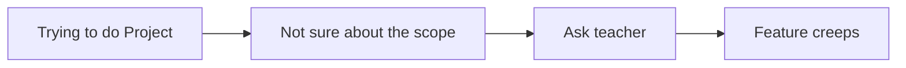

# [DB MGT SYS Project] Reg with Feature Creeps (and Senior Projects)

## Development

1. Clone the repository
2. Install dependencies using `npm install`
3. There's a default config file located at `/src/config.default.ts`. Make a duplicate and call it `/src/config.ts`, and write a configuration similar to the default one. The backend will use the default values if they are not specified in `config.ts` so you only need to write configurations you want to overwrite.

#### Warning: If you want to set up a shared database, `dropSchema` in `config.orm` **MUST** be set to `false`.

4. To run the development server, run `npm run watch`

### Notes

 - You can use `~` as an alias for `./src/`, so you don't need to write `../../../entity`, just write `~/entity` instead.
 - If you want to add more path aliases, add them in both the `tsconfig.json` and the `_moduleAliases` object in `package.json` (see example).
 - It's *typescript*. Try not to be cheap and define types.
